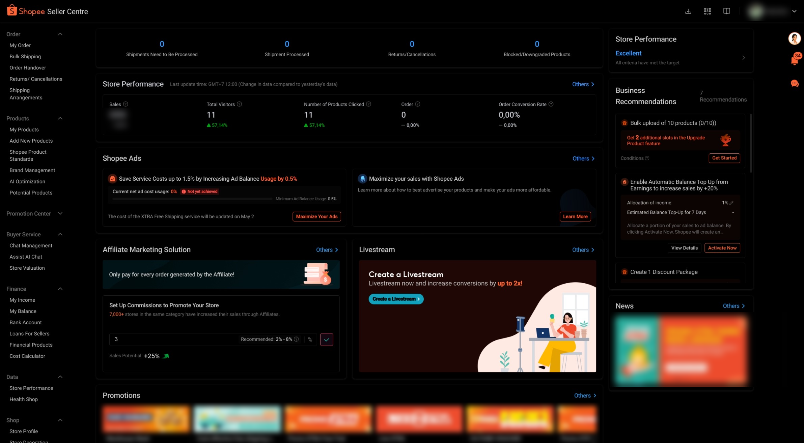

# Shopee Seller Dark Mode

A dark mode userstyle for Shopee Seller platforms.

## Features

- Provides a dark mode experience for various Shopee Seller platforms using CSS filtering techniques.
- Includes scrollbar customization.

## Supported Domains

- seller.shopee.co.id
- seller.shopee.sg
- seller.shopee.com.my
- seller.shopee.ph
- seller.shopee.co.th
- seller.shopee.vn
- seller.shopee.tw
- seller.shopee.com.br
- seller.shopee.com.mx

## Installation

1. Install the [Stylus](https://add0n.com/stylus.html) extension for your browser.
2. Install the style directly from [Userstyles.world](https://userstyles.world/style/30428/shopee-seller-dark-mode),
   or copy the contents of `main.css` and create a new style in Stylus.

## Screenshot

## License

This project is licensed under the MIT License.
